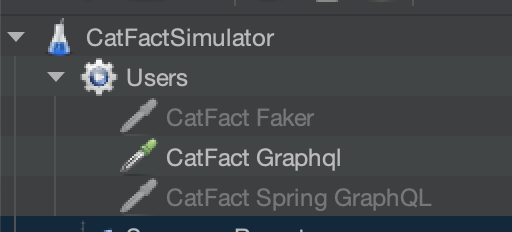
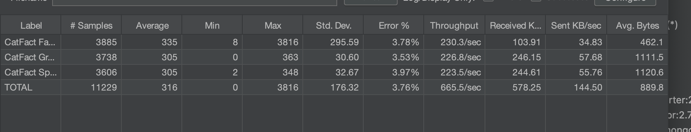
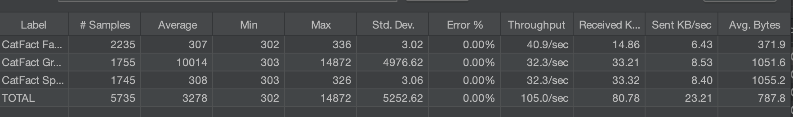
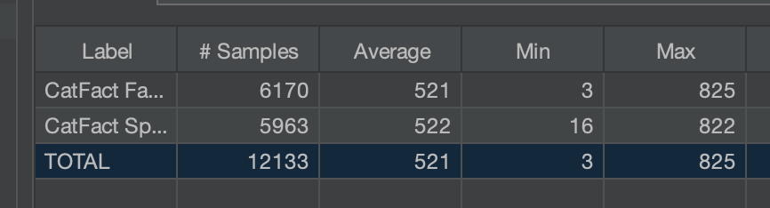
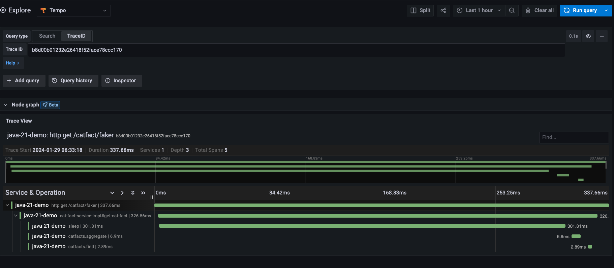

# Java 21 - Spring Boot 3 Demo

This is a simple demo app that showcases the following deatres

* Virtual Threads (Project Loom)
* Spring GraphQL
* RestClient
* Observability
* Enhanced TestContainers support


## Getting Started
You will need the following installed:
* Docker
* Java 21
* An IDE (IntelliJ) - technically you can run this without an IDE
* JMeter (```brew install jmeter```)

To start supporting services such as grafana, grafana tempo and prometheus [see here](docker-compose.yml) simply run:
``` docker compose up -d ```

To stop the supporting services you can run:
``` docker compose down ```

To compile (ignoring the tests) run:
``` ./gradlew clean build -x test```


### On start up
When the service starts up, it will initialise a Mongo container via test containers [here](src/main/java/dev/simonrowe/java21demo/mongo/MongoDBConfig.java)

```java
    @Bean
    @ServiceConnection
    MongoDBContainer mongoDBContainer() {
        return new MongoDBContainer();
    }
```
Additionally a collection called *catfacts* will also be seeded with some initial test data:

```java
    @ChangeSet(order = "0001", id = "seedInitialData", author = "Simon Rowe")
    public void seedData(@NonLockGuarded final MongockTemplate mongockTemplate) {
        final Faker faker = new Faker();
        for (int i = 1; i < 300; i++) {
            var catfact = String.format("%s - %s", faker.cat().name(), faker.chuckNorris().fact());
            var fact = new CatFact(i, catfact, catfact.length());
            log.info("Seeding Catfact; {}", fact);
            mongockTemplate.save(fact, "catfacts");
        }
    }
```

### Running the example
In IntelliJ simply run the [Java21DemoApplication](src/main/java/dev/simonrowe/java21demo/Java21DemoApplication.java)

Open up JMeter and run the script [CatFact](src/test/resources/CatFact.jmx) and you will see a simulation with 500
users running 50 requests with a ramp up time of 20 seconds.



* CatFact Faker - http calls to /catfacr/faker
* Catfact Graphql - graphql queries to catFact query using KickStart Graphql Spring Boot Starter
* Catfact Graphql - graphql queries to catFact query using SpringGraphQL

Run with all 3 enabled:



Now make some tweaks to the application to turn off virtual threads:
```yml
spring:
  application:
    name: java-21-demo
  graphql:
    cors:
      allowed-headers: '*'
    path: "/graphql-spring"
  threads:
    virtual:
      enabled: false
```

```java
  //  @Bean("graphqlAsyncTaskExecutor")
```

and run the tests again:


Now disable the kickstart graphql calls and run again



### Observability
Spring boot 3 will start to instrument any class or method annotated with ```@Observed```

If we make a simple rest call to http://localhost:8080/catfact/faker and query loki by trace id using http://localhost:3000

```text
2024-01-29T06:33:19.068Z  INFO 89868 --- [nio-8080-exec-2] [java-21-demo,b8d00b01232e26418f52face78ccc170,5b3b807f041c35a8] d.s.j.service.CatFactServiceImpl         : Returning catfact CatFact[id=284, fact=Lily - Chuck Norris doesn't need a debugger, he just stares down the bug until the code confesses., length=98]

```




To set up mongodb for observability see this code snippet:
```java
    @Bean
    MongoClientSettingsBuilderCustomizer mongoMetricsSynchronousContextProvider(ObservationRegistry registry) {
        return (clientSettingsBuilder) -> {
            clientSettingsBuilder.contextProvider(ContextProviderFactory.create(registry))
                .addCommandListener(new MongoObservationCommandListener(registry));
        };
    }
```

To observe some code in a declarative fashion you will need to use the ObservationRegistry:

```java
        var observation = Observation.createNotStarted("sleep", observationRegistry);
        observation.observe(() -> {
            try {
                Thread.sleep(300);
            } catch (Exception e) {
            }
        });
```

### HTTP Client
There is also an endpoint a http://localhost:8080/catfact/proxy - which makes a call to  https://catfact.ninja/fact

You can see config for the Spring's new RestClient  [here](src/main/java/dev/simonrowe/java21demo/rest/CatFactClientConfig.java)


